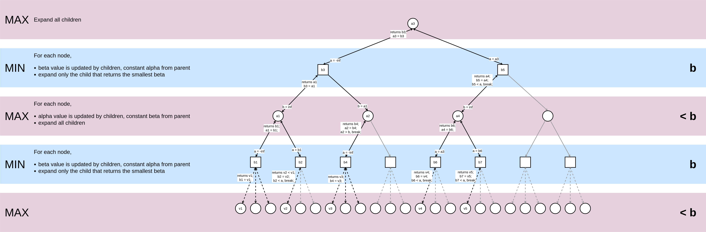
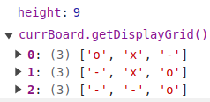
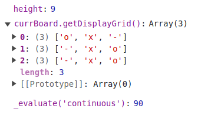
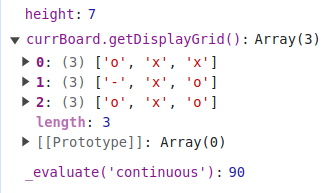

# Classic Tic Tac Toe

A single-round 3-by-3 Tic Tac Toe game. A user may choose to play against a bot that uses the Minmax algorithm to decide its moves.

Based on [The Odin Project > JavaScript Course > Tic Tac Toe Assignment](https://www.theodinproject.com/lessons/node-path-javascript-tic-tac-toe).

Practiced creating factory functions for objects that require multiple instances (eg. Player) and modules for objects that don't (eg. Controllers, Game Board). The goal is to keep global variables to a minimum. All these are wrapped in an IIFE with 2 lines of initiation code. No object constructors were used.

## Algorithm

### Minmax

The largest value the player can be sure to get when they know the actions of the other players.

- For each possible action of the opponent, filter the actions that give the maximum payoff for themselves.
  - In the game tree: return the most positive value when it is bot's turn
- From the actions that give the maximum payoffs, take the action that gives the minimum payoff.
  - In the game tree: return the most negative value when it is opponent's turn

#### Complexity

**_Time Complexity: O(bm)_**

| depth | numNodes      | time             |
| ----- | ------------- | ---------------- |
| 0     | 1             | c                |
| 1     | b             | cb               |
| 2     | b2 | (cb)2 |
| ...   | ...           | ...              |
| m     | bm | (cb)m |

O(c + cb + cb2 + ... + (cb)m) = O((cb)m) = O(bm)

**_Space Complexity: O(bm)_**

where

- _b_ is the (average) number of legal moves at each point (branching factor)
- _m_ is the maximum depth of the tree

#### Evaluation Function

The value of the board state is determined by:

- +10 for the bot's win.
- -10 for the opponent's win.
- 0 otherwise.

### Minmax with Alpha-Beta Pruning

At the maximizing level, each node's `alpha` is updated by its children while `beta` — which holds the smallest value among its preceding siblings — is held constant for comparison. If the latest `alpha` value is greater than or equal to `beta`, do not continue searching the other children as the largest value out of all its children — what this maximizing node will return as its `bestScore` — will also exceed `beta`, meaning the parent node (a minimizing node) will never consider this current node.

At the minimizing level, each node's `beta` is updated by its children while `alpha` — which holds the greatest value among its preceding siblings — is held constant for comparison. If the latest `beta` value is smaller than or equal to `alpha`, do not continue searching the other children as the smallest value out of all its children — what this minimizing node will return as its `bestScore` — will also be less than `alpha`, meaning the parent node (a maximizing node) will never consider this current node.

#### Complexity

**_Time Complexity: O(bm/2)_**
in the best case

> If the move ordering for the search is optimal (meaning the best moves are always searched first), the number of leaf node positions evaluated is about O(b×1×b×1×...×b) for odd depth and O(b×1×b×1×...×1) for even depth, or O(bd/2). In the latter case, where the ply of a search is even, the effective branching factor is reduced to its square root, or, equivalently, the search can go twice as deep with the same amount of computation. The explanation of b×1×b×1×... is that all the first player's moves must be studied to find the best one, but for each, only the second player's best move is needed to refute all but the first (and best) first player move—alpha–beta ensures no other second player moves need be considered.
> [Source](https://en.wikipedia.org/wiki/Alpha%E2%80%93beta_pruning)

  
_Figure 1: Tracing a pruned minmax tree where the ordering is optimal_

#### Evaluation Function

The value of the board state is determined by:

- +100 for EACH 3-in-a-line for computer.
- +10 for EACH two-in-a-line (with a empty cell) for computer.
- +1 for EACH one-in-a-line (with two empty cells) for computer.
- Negative scores for opponent, i.e., -100, -10, -1 for EACH opponent's 3-in-a-line, 2-in-a-line and 1-in-a-line.
- 0 otherwise (empty lines or lines with both computer's and opponent's seeds).

Lastly, sum the scores for each of the 8 lines (3 rows, 3 columns and 2 diagonals).

### Problems Faced

Some winning moves at higher levels of the tree (moves that allow the bot win earlier) were ignored by the `if (currScore > bestScore)` condition as the heuristic returned the same scores.

  
_Figure 2: Initial State_

  
_Figure 3: Ideal next move = [2, 1]_

  
_Figure 4: Next move taken = [0, 2]_

To prioritize winning moves that occur earlier in the game, each line that has 3 of the same symbols will have a `weight` proportional to the number of possible moves remaining (i.e. inversely proportional to the number of turns that have been taken) attached — `weight * 100` for the bot and `weight * -100` for the opponent.

## To-do

- [ ] Allow players to enter their preferred player name
- [ ] Add an option to play for multiple rounds

## References

1. [Case Study on Tic-Tac-Toe Part 2: With AI](https://www3.ntu.edu.sg/home/ehchua/programming/java/JavaGame_TicTacToe_AI.html)
2. [Minimax Algorithm with Alpha-beta pruning](https://www.hackerearth.com/blog/developers/minimax-algorithm-alpha-beta-pruning/)
